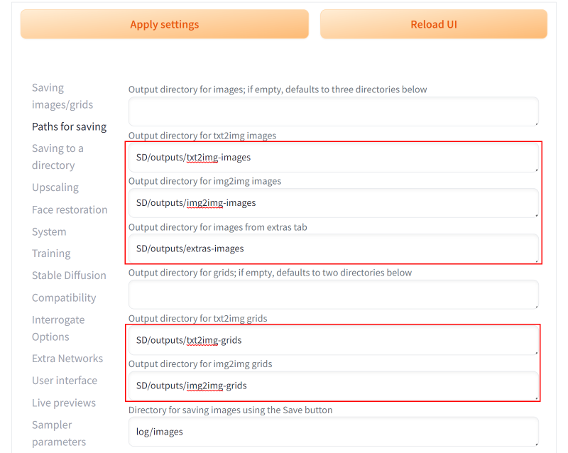
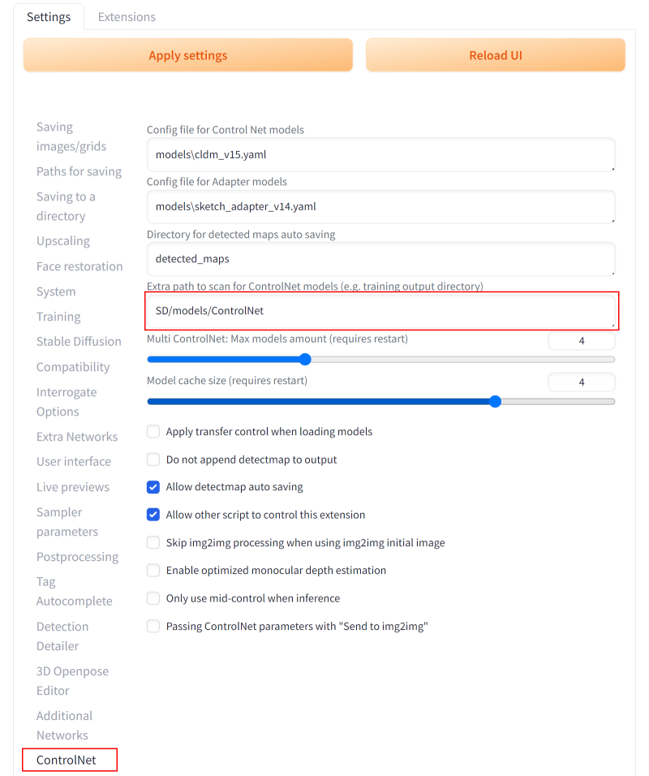
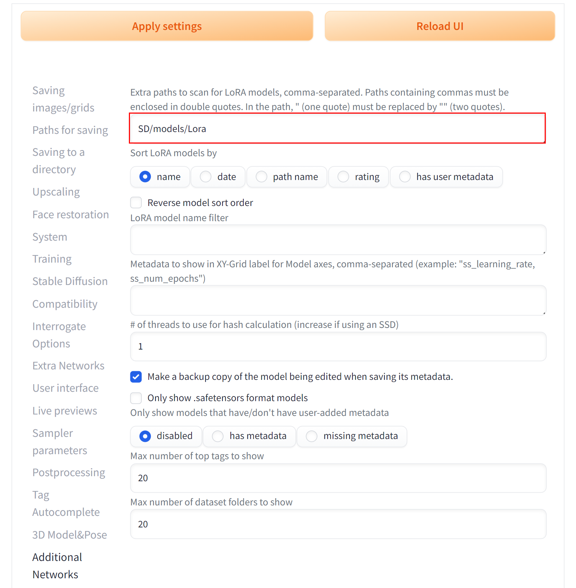
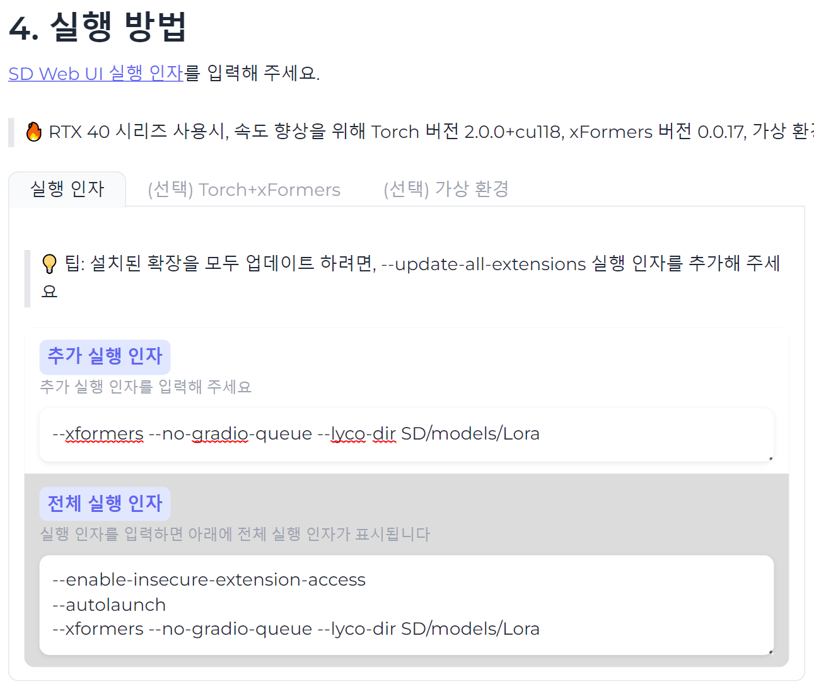

# SD Web UI 경로 설정 예시

## outputs 이미지 저장 경로 설정
> [작업 디렉터리 이름]/outputs

 
 

## Dynamic Prompts
> 구글 드라이브/[작업 디렉터리 이름]/extensions/sd-dynamic-prompts/wildcards

 
 

 
 

## ControlNet 모델 추가 경로 설정
> [작업 디렉터리 이름]/models/ControlNet 
> 구글 드라이브의 위 경로에 ControlNet 모델을 업로드 하세요.

 
 

## Additional Networks 확장 로라 경로 설정
> [작업 디렉터리 이름]/models/Lora

 
 

## a1111-sd-webui-lycoris 확장 로라 경로 설정
> 추가 실행 인자에 --lyco-dir [작업 디렉터리 이름]/models/Lora

 
 